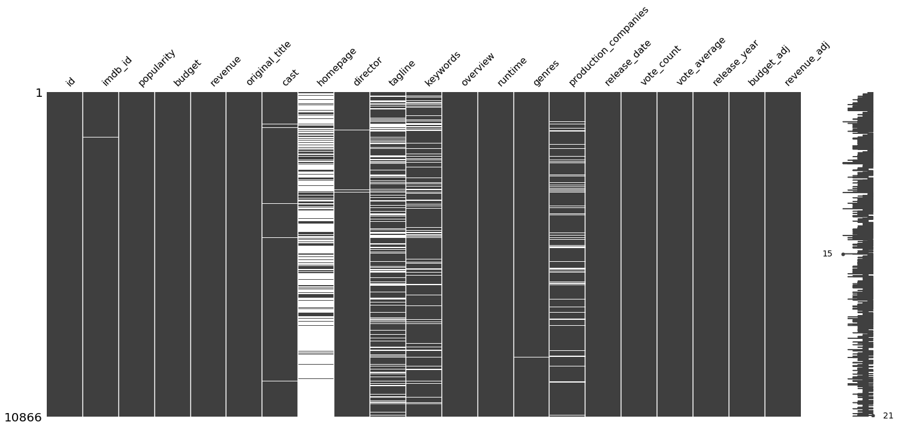

电影项目

 [P2_Explore_Movie_Dataset]( https://github.com/udacity/AIPND_CN_P2_Explore_Movie_Dataset )

 [TMDb电影数据](https://s3.cn-north-1.amazonaws.com.cn/static-documents/nd101/explore+dataset/tmdb-movies.csv) 


反馈

### 数据导入与处理

学生成功导入所需要的库，并通过`Pandas`读取tmdb-movies.csv 中的数据。

学生成功完成 5 个 tasks。

学员对数据表中的空值进行了处理。

现在分享一些检查空值的技巧:

这个数据的缺失包括字符型数据的缺失和数值型数据的缺失, 你应该分开处理, 首先你可以快速用

```
movie_data.info()
```

快速检查数据的类型和缺失情况

字符型的缺失很多时候可以用'Unknown'来填充, **(这个数据集的缺失/异常都是字符型)**. 如果缺失很少, 我们可以进行移除

数值型的缺失/异常有几种处理的方式**(这个数据集的收入/预算很多0值)**:

- 删除: [pandas.DataFrame.dropna](https://pandas.pydata.org/pandas-docs/stable/generated/pandas.DataFrame.dropna.html)
- 填充: [pandas.DataFrame.fillna](https://pandas.pydata.org/pandas-docs/stable/generated/pandas.DataFrame.fillna.html)
  根据需要, 一般会用统计数据, 比如均值, 中位数填充
- 插值: [pandas.DataFrame.interpolate](http://pandas.pydata.org/pandas-docs/version/0.16.2/generated/pandas.DataFrame.interpolate.html)
  根据无效值的前后值, 进行估计并填充, 适合连续有序的数据. 比如`[1, 2, NaN, 4]` 插值后就是`[1, 2, 3, 4]`
- 替换: [pandas.DataFrame.replace](https://pandas.pydata.org/pandas-docs/stable/generated/pandas.DataFrame.replace.html)

参考: [pandas的教程, 处理缺失值](https://pandas.pydata.org/pandas-docs/stable/missing_data.html)

### *Bonus*

如果你希望更快地完成检查工作, 可以尝试使用[missingno](https://github.com/ResidentMario/missingno)这个工具, 一个小展示:

```
missingno.matrix(movie_data)
```

[](https://udacity-reviews-uploads.s3.us-west-2.amazonaws.com/_attachments/42601/1530117252/download.png)

这样我们大概能够知道缺失情况.

### 根据指定要求读取数据

完成3个简单读取的tasks

### 问题

主要是索引的问题

这里要注意的是, 索引应为行数减1, 比如48, 49行的索引应是47, 48, 而不是 48, 49

另外, 你需要修改选择50 ~ 60 行时出现的同样的问题

学员完成逻辑读取中的2个任务

学员使用 Groupby 命令完成2个分组读取任务

### 拓展

这边为你推荐一个groupby的[使用方法整理](https://www.jianshu.com/p/42f1d2909bb6)

### 绘图与可视化

对 popularity 最高的20名电影绘制其 popularity 值。

很多请况下, pandas提供的可视化会更加好用:

```
movie_data.set_index('original_title')['popularity'].sort_values()[-20:].plot(kind='barh')
plt.xlabel('Popularity')
plt.ylabel('Original Title')
plt.title('Top 20 Movies by Popularity ')
```

参考:
[Pandas Visualization](https://pandas.pydata.org/pandas-docs/stable/visualization.html)
它主要是帮助你减少指定数据的烦恼, 非常建议你进行练习

分析电影净利润（票房-成本）随着年份变化的情况，并简单进行分析。

### 问题

注意, 我建议你选择agg的方式的时候, 要考虑一下电影的数量, 在这里, 请思考一下:

- 每一年电影的数量是一致的吗? 电影发行量是不是逐年递增? 如果是的话, 那么直接使用求和能否反映电影收益的变化?
- 如果求和不足以展示电影市场的发展, 需要补充什么信息?
- 我们是否需要考虑每年电影的平均收益, 收益的标准差等统计量?

------

*提示: 你可以研究究每年发行量, 可以尝试对`release_year`列进行[pandas.Series.value_counts](https://pandas.pydata.org/pandas-docs/version/0.23/generated/pandas.Series.value_counts.html), 另外, 我们可以直接用mean进行 agg, 或调用`.mean()`, 用法和`.sum()`一样*

### 建议

一般建议先相减再进行`groupby`, 有些`agg`方式, 比如求每年净利润的标准差, 是不等价于每年票房的标准差减每年成本的标准差的. 另外先相减再求可以可以让我们更容易求其他的统计数据:

```
movie_data['profit'] = movie_data['revenue'] - movie_dat['budget']
movie_data.groupby('release_year')['profit'].mean()
movie_data.groupby('release_year')['profit'].sum()
movie_data.groupby('release_year')['profit'].std()
```

选择最多产的10位导演（电影数量最多的），绘制他们排行前3的三部电影的票房情况，并简要进行分析。

分析1968年~2015年六月电影的数量的变化。

分析1968年~2015年六月电影 Comedy 和 Drama 两类电影的数量的变化。